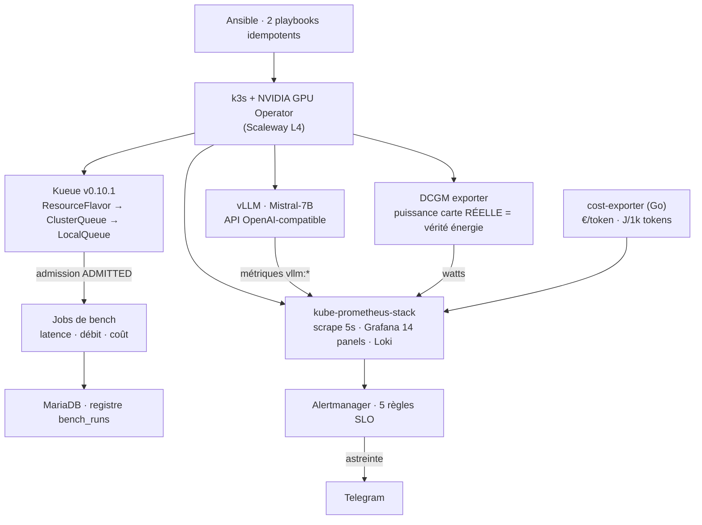

# GPU Inference Reliability Lab

> Servir un LLM français sur un cloud français, et **prouver** qu'on sait l'observer, le
> fiabiliser et en maîtriser le coût (€) et l'énergie (J) — au token près, au watt près.

Mistral-7B servi par vLLM sur Kubernetes (k3s), sur une instance GPU **Scaleway L4**.
Tout est provisionné par Ansible, mesuré par Prometheus/DCGM, et cassé exprès pour
démontrer la boucle complète du SRE : **détection → diagnostic → remédiation → runbook**.

Déployer un modèle sur un GPU, c'est un tutoriel. L'opérer, c'est un métier.
Ce dépôt documente le métier.

## Résultats mesurés (pas estimés)

Premiers chiffres sur L4 24 GB, Mistral-7B-Instruct-v0.3, vLLM v0.6.6 (2026-07-05) :

| Métrique | FP16 | FP8 | Δ |
|---|---|---|---|
| Débit single-stream (tok/s) | 17,4 | 28,3 | **+63 %** |
| Latence P50 (s) | 6,33 | 3,60 | −43 % |
| Puissance moyenne (W, DCGM) | 69,9 | 56,9 | −19 % |
| **Énergie (J / 1k tokens)** | **4 017** | **2 032** | **−49 %** |
| Coût (€ / 1M tokens, L4 à 0,75 €/h) | 11,97 | 7,36 | −39 % |

Détails et protocole : [`docs/bench-fp16-vs-fp8.md`](docs/bench-fp16-vs-fp8.md).
Méthodologie énergie (mesure DCGM vs estimation) : [`docs/energy-methodology.md`](docs/energy-methodology.md).

## Architecture

### Diagramme d'architecture



## Ce que le lab démontre, preuve à l'appui

| Domaine | Preuve dans ce dépôt |
|---|---|
| **Remédiation d'incidents** | 5 [runbooks](runbooks/) vécus (pas théoriques) : pod GPU tué sous charge, registre d'images mort, piège Helm `--reuse-values`, saturation KV cache, [GPU Operator cassé après reboot](runbooks/reboot-driver-mount.md) |
| **Observabilité** | [Dashboard Grafana](dashboards/) 14 panels ; chaque token compté deux fois (API + Prometheus) ; boucle fermée vérifiée |
| **Astreinte / alerting** | [Règles SLO](manifests/alerting/) routées vers Telegram : vLLM down, P99 > 5 s, KV cache > 90 %, GPU au cap, température |
| **GPU & HPC** | vLLM sur L4, comparatif FP16/FP8 mesuré au watt, `runtimeClassName` et deadlock single-GPU documentés |
| **IaC** | [`ansible/`](ansible/) : instance nue → plateforme complète en 2 playbooks relançables |
| **CI/CD GitLab** | [`.gitlab-ci.yml`](.gitlab-ci.yml) : lint (yaml/ansible/python/go) → build → deploy → bench via Kueue |
| **Ordonnancement multi-tenant** | [Quota Kueue](manifests/kueue/) ; les benchs sont des Jobs **admis par la file** (`ADMITTED=True`) |
| **Go / Python** | [`exporter/`](exporter/) (€/token, J/1k tokens) ; [`bench/`](bench/) (harness latence/débit/coût) |
| **MariaDB** | [Registre `bench_runs`](bench/schema.sql) alimenté par les Jobs de bench |
| **Réseau** | [`docs/reseau.md`](docs/reseau.md) : du tunnel SSH au design BGP/IPv6/InfiniBand multi-nœud |
| **FinOps** | [`scripts/burst.sh`](scripts/burst.sh) : GPU loué à l'heure, allumé par rafales |

## Incident vécu (résumé)

Kill du pod vLLM en pleine charge (injection de panne, 2026-07-05) :
détection sur dashboard < 10 s (GPU 99 % → 0 %, 72 W → 17 W) · alerte Telegram armée ·
**Kubernetes a recréé le pod et rechargé le modèle en ~4 min, sans intervention**.
Timeline complète et leçons : [`runbooks/vllm-down.md`](runbooks/vllm-down.md).

## Démarrage

```bash
# 1. Une instance GPU Scaleway (L4, image "GPU OS passthrough") + son IP dans l'inventaire
cp ansible/inventory.ini.example ansible/inventory.ini   # renseigner l'IP

# 2. Fondation : k3s + GPU Operator
ansible-playbook -i ansible/inventory.ini ansible/playbook.yml

# 3. Plateforme : Kueue + monitoring + alerting + vLLM (+ token HF pour Mistral)
ansible-playbook -i ansible/inventory.ini ansible/apps.yml -e hf_token=hf_***

# 4. Accès (rien n'est exposé publiquement — tunnels SSH)
ssh -L 3000:localhost:3000 root@<IP> 'kubectl -n monitoring port-forward svc/kps-grafana 3000:80'
# -> http://localhost:3000, dashboard "GPU Inference Reliability Lab"

# 5. Un bench admis par Kueue, résultats en MariaDB
kubectl apply -f manifests/bench/job.yaml
```

Secrets attendus (jamais dans le dépôt) : `hf-token` (Hugging Face, modèle gated),
`telegram-bot-token` (alerting), `mariadb-creds` (registre bench).

## Garde-fou méthodologique

**DCGM = mesure** (télémétrie physique de la carte, watts réels).
Les outils qui *estiment* l'énergie par modèle statistique sont utiles mais ne sont pas
des mesures, et sur du virtualisé ils n'ont souvent pas accès aux vrais compteurs.
Ici, chaque chiffre publié dit de quelle famille il vient. Vendre une estimation comme
une mesure, c'est exactement le flou que ce lab s'interdit — y compris quand le chiffre
estimé serait plus flatteur (cf. la limite qualité non mesurée du bench FP8).

## Coût du lab

GPU L4 Scaleway loué à l'heure (~0,75 €/h), allumé par rafales (`scripts/burst.sh`) →
la totalité des mesures de ce dépôt a coûté quelques euros.

## Contexte

Lab construit comme preuve opérationnelle pour [GPUInfraSystems](https://gpuinfrasystems.com)
— observabilité et fiabilité d'inférence GPU sur infrastructure souveraine européenne.
Modèle 🇫🇷 (Mistral), cloud 🇫🇷 (Scaleway), stack 100 % open source.
